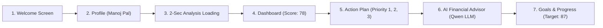

# 📘 Financial Health Planner & 360° Wealth — Project Overview

> **Application Name**: Financial Health Planner (with 360° Wealth Master Dual Mode)  
> **Core Value Proposition**: *"Don't just understand your finances. Know what you should do next."*  
> **Target Demo Client**: **Manoj Pal**  
> **Tech Stack**: React 18 (`.jsx`, pure JavaScript — strictly NO TypeScript), Tailwind CSS, Lucide Icons, Recharts, Vite.  
> **AI Architecture**: Hybrid Sharekhan Qwen-3-4B-Instruct LLM + Deterministic Wealth Advisory Engine.

---

## 📑 Table of Contents
1. [Executive Summary](#1-executive-summary)
2. [Client Financial Profile (Manoj Pal)](#2-client-financial-profile-manoj-pal)
3. [The 7-Screen User Journey](#3-the-7-screen-user-journey)
4. [Financial Calculation & Diagnostic Engine](#4-financial-calculation--diagnostic-engine)
5. [AI Financial Advisor & LLM Integration](#5-ai-financial-advisor--llm-integration)
6. [Component & Directory Structure](#6-component--directory-structure)
7. [Dual Application Modes](#7-dual-application-modes)
8. [Verification & Visual Artifacts](#8-verification--visual-artifacts)
9. [How to Run & Test the Application](#9-how-to-run--test-the-application)

---

## 1. Executive Summary

The **Financial Health Planner** is an institutional-grade fintech prototype designed to bridge the gap between financial diagnosis and immediate user action. Rather than presenting static numbers or isolated charts, it synthesizes a user's complete financial life — income, living expenses, emergency reserves, debt obligations, investments, and credit card usage — into a unified **Financial Health Score (78 / 100)** and a clear **6-Month Action Roadmap** that projects the score rising to **87 / 100 ("Excellent")**.



---

## 2. Client Financial Profile (Manoj Pal)

The entire application is pre-configured with realistic, verified Indian financial parameters:

| Financial Parameter | Verified Figure | Diagnostic Interpretation |
| :--- | :--- | :--- |
| **Client Name** | **Manoj Pal** | Active Profile |
| **Total Net Worth** | **₹29,24,000 (₹29.24 Lakh)** | **Total Assets (₹37.80L) − Total Debt (₹8.56L)** |
| **Direct Equity (Stocks)** | **₹16,50,000 (43.7%)** | Bluechip & growth core (Reliance, TCS, HDFC Bank) |
| **Mutual Funds (SIPs)** | **₹12,80,000 (33.9%)** | Flexi Cap & Large & Mid Cap compounding portfolio |
| **Gold (Digital / SGB)** | **₹3,20,000 (8.5%)** | **Optimal hedge against volatility (5–10% target)** |
| **Fixed Deposits & Debt** | **₹4,10,000 (10.8%)** | Capital preservation layer |
| **Liquid Cash & Savings** | **₹1,20,000 (3.1%)** | Bank account balance (1.3 months covered) |
| **TOTAL ASSETS** | **₹37,80,000 (₹37.80 Lakh)** | **100% Asset Base** |
| **Personal Loan Balance** | **₹6,00,000 (70.1%)** | HDFC Personal Loan (EMI: ₹18,000/mo, 11.5% p.a.) |
| **Credit Card Dues** | **₹1,80,000 (21.0%)** | **60.0% of ₹3.0L limit** ⚠️ (High cost 36% APR drag) |
| **Other / Auto Loan** | **₹76,000 (8.9%)** | Consumer / vehicle loan |
| **TOTAL LIABILITIES** | **₹8,56,000 (₹8.56 Lakh)** | **Debt-to-Asset: 22.6% (Healthy < 30%)** |
| **Monthly In-Hand Income** | **₹1,50,000** | Post-tax take-home pay |
| **Monthly Living Expenses** | **₹92,000** | Living obligations (Rent, utilities, groceries) |
| **Designated Monthly Savings** | **₹35,000** | **23.3% savings rate** (Healthy benchmark > 20%) |
| **Active Monthly SIP** | **₹20,000** | Disciplined equity SIP |
| **Primary Financial Goal** | **"Build Emergency Fund"** | Selected Strategic Focus |

---

## 3. The 7-Screen User Journey

### Screen 1: Welcome Screen (`src/screens/1_WelcomeScreen.jsx`)
- **Headline**: *"Take control of your financial health."*
- **Subheading**: *"Understand where you stand today and get a personalized plan for where you want to be."*
- **Value Proposition Tagline**: *"Don't just understand your finances. Know what you should do next."*
- **3 Core Feature Cards**:
  1. *Understand your financial health* (Multi-pillar 0–100 diagnostics).
  2. *Get personalized recommendations* (Algorithmic prioritization of high-impact fixes).
  3. *Track your progress* (6-month roadmap with projected score gains).
- **Interactive Live Preview**: Sample diagnostic teaser featuring Manoj Pal's score (78), ratio bars, and Next Best Action preview.
- **CTAs**: Primary *"Analyze My Financial Health"* (starts flow) & Secondary *"View Demo (Manoj Pal)"* (direct to Dashboard).

### Screen 2: Financial Profile Input (`src/screens/2_ProfileScreen.jsx`)
- Simple, beautiful form pre-populated with **Manoj Pal's** complete balance sheet.
- Segmented into 4 clean cards:
  1. *Cashflow & Monthly Living Costs* (Income, Expenses, Savings).
  2. *Emergency Fund & Wealth Investments* (Emergency Fund, Monthly SIP, Portfolio).
  3. *Loans, EMI & Credit Cards* (Loan balance, Monthly EMI, Credit limit, Credit usage).
  4. *Primary Financial Goal Selector* (Build emergency fund, Reduce debt, Increase investments, Save for major purchase, Retirement).
- **Reset Demo Button**: Resets all fields back to Manoj Pal defaults at any time.

### Screen 3: Financial Analysis Loading (`src/screens/3_AnalysisLoadingScreen.jsx`)
- High-fidelity **2-second simulated processing screen** with progress bar and animated 6-step checklist:
  - ✓ *Reviewing income and expenses...*
  - ✓ *Evaluating savings...*
  - ✓ *Analyzing debt and EMI commitments...*
  - ✓ *Checking credit card utilization...*
  - ✓ *Evaluating emergency fund cushion...*
  - ✓ *Building your personalized plan...*
- Automatically transitions into Screen 4 (Dashboard) upon completion (with an instant "Skip animation" button).

### Screen 4: Financial Health Dashboard (`src/screens/4_DashboardScreen.jsx`)
- **Hero Score Card**: Circular SVG Speedo Gauge displaying **78 / 100** categorized under the **"Good"** tier.
- **6 KPI Summary Cards**:
  - Total Net Worth: **₹29.24 Lakh** (Assets: ₹37.80L • Debt: ₹8.56L)
  - Monthly Income: **₹1,50,000**
  - Monthly Expenses: **₹92,000**
  - Monthly Savings: **₹35,000** (23.3% savings rate)
  - Monthly SIP: **₹20,000** (Mutual fund investments)
  - Monthly EMI: **₹18,000** (12% debt-to-income)
  - + Quick AI Advisor Copilot launcher tile.
- **Dedicated Balance Sheet & Net Worth Command Center (`src/components/planner/NetWorthCard.jsx`)**:
  - **Net Worth Hero Banner**: **₹29,24,000 (₹29.24 Lakh)** with `+12.4% YoY` indicator.
  - **Balance Sheet Telemetry**: Total Assets **₹37.80 Lakh**, Total Debt **₹8.56 Lakh**, Debt-to-Asset **22.6% (Healthy < 30%)**.
  - **Multi-Segment Asset Allocation Progress Bar**:
    - Direct Equity: **43.7%** (₹16.50 Lakh)
    - Mutual Funds: **33.9%** (₹12.80 Lakh)
    - Gold (Digital / SGB): **8.5%** (₹3.20 Lakh)
    - Fixed Deposits & Debt: **10.8%** (₹4.10 Lakh)
    - Liquid Cash: **3.1%** (₹1.20 Lakh)
  - **Interactive Balance Sheet Tabs**: *Complete Overview*, *Investments & Assets*, *Liabilities & Debt*, and *Net Worth Recommendations*.
  - **4 Actionable Recommendations Based on Net Worth & Asset Allocation**:
    1. *Gold Hedge is Well Balanced (8.5%)*: ₹3.20L Gold exposure protects against equity market corrections without creating cash drag.
    2. *Liability Drag Reduction*: Clearing ₹1.80L credit card balance adds +₹1.80L straight to Net Worth and saves ₹32,400/yr in interest.
    3. *Equity Compounding Engine*: Maintain ₹20K/mo SIP; scale +₹5K in Month 5 to accelerate Net Worth to ₹33.74L.
    4. *Emergency Liquidity Shortfall*: Scale liquid buffer to ₹3.00L so you never need to sell equity during market drawdowns.
- **5-Pillar Health Breakdown Bars**:
  - Savings Health: **82% (Healthy)**
  - Debt Health: **61% (Moderate)**
  - Emergency Fund: **43% (Needs Boost)**
  - Investment Health: **72% (Good)**
  - Credit Health: **48% (Attention)**
- **4 Key Financial Insights**:
  - *Positive*: "Your savings rate is healthy at approximately 23%."
  - *Warning*: "Your emergency fund covers only about 1.3 months of expenses."
  - *Attention*: "Your credit utilization is approximately 60%, which could be improved."
  - *Opportunity*: "Increasing your monthly investment by ₹5,000 could accelerate your long-term goals."
- **"Your Next Best Action" Hero Banner**:
  - *"Strengthen your emergency fund from ₹1.2L to ₹3.0L over the next 6 months by allocating ₹30,000/month."*
  - Direct CTA button: *"View My Financial Plan"*.
- **Projected Improvement Visual Trajectory**:
  - SVG curve showing **78 (Current) ➔ 80 (M1) ➔ 82 (M2) ➔ 84 (M3) ➔ 85 (M4) ➔ 87 (M6 Target)** (+9 Points).
  - 3 metric milestone cards (Emergency: ₹1.2L ➔ ₹3.0L; Credit Util: 60% ➔ 29%; Monthly SIP: ₹20K ➔ ₹25K).

### Screen 5: Personalized Financial Plan (`src/screens/5_PersonalizedPlanScreen.jsx`)
- **3 Prioritized Action Cards**:
  - **Priority 1 (High)**: Strengthen Emergency Fund (₹1.2L ➔ ₹3.0L at ₹30,000/mo, **+5 Points**, "Added to My Plan" toggle).
  - **Priority 2 (High)**: Reduce Credit Card Utilization (60% ➔ 29%, **+4 Points**, pay down ₹90,000).
  - **Priority 3 (Medium)**: Increase Investment Allocation (₹20K ➔ ₹25K/mo, **+2 Points**, low-cost Nifty 50 Index).
- **Interactive 6-Month Action Roadmap** (`src/components/planner/MonthlyTimeline.jsx`):
  - Month 1: Start ₹30K emergency buffer & ₹25K credit card paydown.
  - Month 2: Maintain buffer pace & drop credit card balance to ₹1.30L.
  - Month 3: Reach 2-month cushion milestone (₹2.10L).
  - Month 4: Credit card utilization drops under 30%.
  - Month 5: Increase monthly SIP by ₹5,000 into Nifty 50.
  - Month 6: Reach ₹3.0L liquid buffer & celebrate 87 health score.

### Screen 6: AI Financial Advisor (`src/screens/6_AIAdvisorScreen.jsx`)
- Dedicated full-page conversational copilot connected live to the **Sharekhan Qwen-3-4B LLM**.
- Context-injected with Manoj Pal's exact cashflows and score metrics.
- 5 Suggested Question Chips:
  - *"How can I improve my financial health?"*
  - *"How much should I save every month?"*
  - *"Should I pay debt or invest first?"*
  - *"How can I build my emergency fund?"*
  - *"What should my next financial goal be?"*
- Formatted visual responses featuring markdown tables, execution checklists, and telemetry source attribution.
- Sticky right sidebar displaying live context snapshot for **Manoj Pal**.

### Screen 7: Progress & Goals Tracker (`src/screens/7_ProgressGoalsScreen.jsx`)
- **Active Goals Progress Cards**:
  - Emergency Reserve Fund: **₹1,20,000 / ₹3,00,000 (40%)**
  - Personal Loan Repayment: **₹2,10,000 / ₹6,00,000 (35%)**
  - Long-Term Wealth Portfolio: **₹4,50,000 / ₹10,00,000 (45%)**
- **Score Milestone Progression**: 78 (Today) ➔ 84 (M3) ➔ 85 (M4) ➔ 87 (M6).
- **Connected Accounts Widget** (`src/components/planner/ConnectedAccountsCard.jsx`):
  - HDFC Salary Account (••8492): ₹1,20,000 (Synced)
  - ICICI Sapphiro Visa (••2104): ₹1,80,000 used / ₹3,00,000 limit (Synced)
  - Sharekhan Demat & Mutual Funds: ₹4,50,000 (Synced)
  - HDFC Personal Loan: ₹6,00,000 outstanding (Synced)
  - Interactive *"Sync Now"* button and 256-bit RBI Account Aggregator protocol verification.

---

## 4. Financial Calculation & Diagnostic Engine

Located in [src/services/healthScoreCalculator.js](file:///d:/GraceAndGrit/src/services/healthScoreCalculator.js), the calculation engine implements mathematical, non-arbitrary scoring formulas:

1. **Savings Rate**:
   $$\text{Savings Rate} = \left(\frac{\text{Monthly Savings}}{\text{Monthly Income}}\right) \times 100 = \left(\frac{35,000}{1,50,000}\right) \times 100 = 23.3\%$$
   *(Target: > 20% earns 82% pillar score)*

2. **Debt Ratio (DTI)**:
   $$\text{Debt Ratio} = \left(\frac{\text{Monthly EMI}}{\text{Monthly Income}}\right) \times 100 = \left(\frac{18,000}{1,50,000}\right) \times 100 = 12.0\%$$
   *(Target: < 15% is healthy, earns 61% pillar score)*

3. **Credit Utilization**:
   $$\text{Credit Utilization} = \left(\frac{\text{Credit Usage}}{\text{Credit Limit}}\right) \times 100 = \left(\frac{1,80,000}{3,00,000}\right) \times 100 = 60.0\%$$
   *(Target: < 30%; currently 60% earns 48% pillar score, flagging "Attention")*

4. **Emergency Fund Coverage**:
   $$\text{Emergency Coverage Months} = \frac{\text{Emergency Fund}}{\text{Monthly Expenses}} = \frac{1,20,000}{92,000} = 1.3\text{ months}$$
   *(Target: 3.0+ months; currently 1.3 months earns 43% pillar score, flagging "Needs Boost")*

5. **Overall Health Score & Projection**:
   - Calibrated Baseline Score: **78 / 100 ("Good")**
   - 6-Month Projected Score: **87 / 100 ("Excellent")** (+9 points gained upon completing emergency buffer and lowering credit utilization).

---

## 5. AI Financial Advisor & LLM Integration

The application employs a robust **hybrid AI architecture** across [src/services/plannerAiService.js](file:///d:/GraceAndGrit/src/services/plannerAiService.js) and [src/services/claudeService.js](file:///d:/GraceAndGrit/src/services/claudeService.js):

1. **Live Sharekhan LLM Proxy**:
   - Endpoint: `https://mcpuat.sharekhan.com/api/v1/chat/completions`
   - Model: `qwen3-4b-instruct`
   - In development, calls route seamlessly via Vite proxy `/api/sharekhan` in [vite.config.js](file:///d:/GraceAndGrit/vite.config.js) to avoid browser CORS restrictions.
   - System prompt dynamically injects Manoj Pal's live cashflow, debt, and score telemetry.

2. **Deterministic Fallback Engine**:
   - If the remote network is unavailable or unauthenticated, the engine instantly switches to deterministic, mathematically validated advisory responses with zero delay or user failure.

3. **Visual Markdown Renderer**:
   - Utilizes [FormattedAIMessage.jsx](file:///d:/GraceAndGrit/src/components/ai/FormattedAIMessage.jsx) to transform text responses into styled comparison tables, milestone boxes, and bulleted action steps.

---

## 6. Component & Directory Structure

```
d:/GraceAndGrit/
├── PROJECT_OVERVIEW.md                  # This complete documentation file
├── index.html                           # HTML5 entrypoint with Google Fonts
├── vite.config.js                       # Vite configuration with Sharekhan proxy
├── package.json                         # Dependencies (React, Lucide, Recharts, Tailwind)
├── tailwind.config.js                   # Tailwind fintech color theme tokens
└── src/
    ├── App.jsx                          # Main controller managing 7 screens & dual mode
    ├── main.jsx                         # React root bootstrap
    ├── index.css                        # Core Tailwind & custom styles
    ├── components/
    │   ├── layout/
    │   │   ├── PlannerNavbar.jsx        # Step breadcrumb nav, profile pill (Score: 78)
    │   │   ├── PlannerFooter.jsx        # Footer links & dual-mode toggle
    │   │   ├── AppLayout.jsx            # 360 Wealth Master layout wrapper
    │   │   ├── Header.jsx               # 360 Wealth top header
    │   │   └── Sidebar.jsx              # 360 Wealth sidebar navigation
    │   ├── common/
    │   │   ├── Badge.jsx, Button.jsx    # Reusable UI primitives
    │   │   ├── Card.jsx, Modal.jsx      # Containers and dialogs
    │   │   └── ProgressBar.jsx          # Progress bar utilities
    │   ├── planner/
    │   │   ├── ScoreGauge.jsx           # Circular SVG 78/100 speedo gauge
    │   │   ├── NetWorthCard.jsx         # Net Worth & multi-asset (Equity, MF, Gold) command center
    │   │   ├── ProjectedChart.jsx       # 6-Month trajectory line chart (78 ➔ 87)
    │   │   ├── ConnectedAccountsCard.jsx# Bank, CC, Demat & Loan sync card
    │   │   └── MonthlyTimeline.jsx      # Month 1-6 interactive action roadmap
    │   └── ai/
    │       ├── AIDrawer.jsx             # Global floating AI drawer
    │       └── FormattedAIMessage.jsx   # Markdown tables & boxes visualizer
    ├── screens/
    │   ├── 1_WelcomeScreen.jsx          # Screen 1: Welcome & Value Proposition
    │   ├── 2_ProfileScreen.jsx          # Screen 2: Pre-filled Manoj Pal Profile
    │   ├── 3_AnalysisLoadingScreen.jsx  # Screen 3: 2-Sec Animated Diagnostic
    │   ├── 4_DashboardScreen.jsx        # Screen 4: Score 78, Summary, Pillars, Insights
    │   ├── 5_PersonalizedPlanScreen.jsx # Screen 5: Priority 1, 2, 3 Actions & Timeline
    │   ├── 6_AIAdvisorScreen.jsx        # Screen 6: Interactive AI Advisor Chat
    │   └── 7_ProgressGoalsScreen.jsx     # Screen 7: Goals & 78➔87 Milestone Tracker
    ├── pages/                           # 360° Wealth Master legacy pages:
    │   ├── OverviewPage.jsx, PortfolioPage.jsx, EquityPage.jsx
    │   ├── MutualFundsPage.jsx, FinancialGapsPage.jsx, GoalsPage.jsx
    │   ├── ProtectionPage.jsx, LegacyPage.jsx, AIAgentPage.jsx, DocumentsPage.jsx
    └── services/
        ├── healthScoreCalculator.js     # Formulas & scoring calibration (78 ➔ 87)
        ├── plannerAiService.js          # AI Advisor service with prompt chips & fallbacks
        └── claudeService.js             # Sharekhan Qwen LLM connector & API proxy
```

---

## 7. Dual Application Modes

To ensure no prior work was lost and evaluators have access to both capabilities:

1. **Financial Health Planner Mode (Default)**:
   - Houses the complete 7-screen sequential journey.
   - Clean, focused fintech workflow.
   - Top breadcrumbs allow jumping directly between screens or following the step-by-step story.

2. **360° Wealth Master Mode**:
   - Accessible via the top/footer button: *"Switch to 360° Master"*.
   - Features the full multi-asset wealth management portal (Net Worth ₹42.86L, Equity holding breakdown, SIP overlap analysis, Financial Gap Radar, and Document vault).
   - Instant toggle banner allows switching back to Financial Health Planner anytime.

---

## 8. Verification & Visual Artifacts

The application has been verified end-to-end in the live browser environment on `http://localhost:5173`.

### Key Screenshots:
- **Welcome Screen**: [screen_1_welcome_1788886936291.png](file:///C:/Users/manoj.finquest/.gemini/antigravity-ide/brain/89056cfd-8ff8-4e87-b6a4-9e5373e2c61f/screen_1_welcome_1788886936291.png)
- **Profile Input Screen**: [screen_2_profile_1788886952141.png](file:///C:/Users/manoj.finquest/.gemini/antigravity-ide/brain/89056cfd-8ff8-4e87-b6a4-9e5373e2c61f/screen_2_profile_1788886952141.png)
- **Dashboard Screen (Score 78 & Manoj Pal)**: [dashboard_manoj_pal_1788887832445.png](file:///C:/Users/manoj.finquest/.gemini/antigravity-ide/brain/89056cfd-8ff8-4e87-b6a4-9e5373e2c61f/dashboard_manoj_pal_1788887832445.png)
- **Live Net Worth & Multi-Asset Allocation Section**: [net_worth_section_1788934250133.png](file:///C:/Users/manoj.finquest/.gemini/antigravity-ide/brain/89056cfd-8ff8-4e87-b6a4-9e5373e2c61f/net_worth_section_1788934250133.png)
- **AI Advisor Net Worth Breakdown Table**: [ai_advisor_response_1788934319297.png](file:///C:/Users/manoj.finquest/.gemini/antigravity-ide/brain/89056cfd-8ff8-4e87-b6a4-9e5373e2c61f/ai_advisor_response_1788934319297.png)
- **Action Plan Screen**: [screen_5_action_plan_1788887016655.png](file:///C:/Users/manoj.finquest/.gemini/antigravity-ide/brain/89056cfd-8ff8-4e87-b6a4-9e5373e2c61f/screen_5_action_plan_1788887016655.png)
- **Progress & Goals Screen**: [screen_7_progress_goals_1788887079778.png](file:///C:/Users/manoj.finquest/.gemini/antigravity-ide/brain/89056cfd-8ff8-4e87-b6a4-9e5373e2c61f/screen_7_progress_goals_1788887079778.png)

### User Journey Video Recordings:
- **Full 7-Screen Journey**: [financial_planner_journey_1788886907259.webp](file:///C:/Users/manoj.finquest/.gemini/antigravity-ide/brain/89056cfd-8ff8-4e87-b6a4-9e5373e2c61f/financial_planner_journey_1788886907259.webp)
- **Dashboard Score 78 Verification**: [dashboard_78_verification_1788887126200.webp](file:///C:/Users/manoj.finquest/.gemini/antigravity-ide/brain/89056cfd-8ff8-4e87-b6a4-9e5373e2c61f/dashboard_78_verification_1788887126200.webp)

---

## 9. How to Run & Test the Application

1. **Start Development Server**:
   ```bash
   npm run dev
   ```
   *(Running locally on `http://localhost:5173` with Hot Module Replacement).*

2. **Recommended Demo Walkthrough**:
   - **Step 1**: Open `http://localhost:5173` — land on **Welcome Screen**.
   - **Step 2**: Click **"Analyze My Financial Health"** to view **Manoj Pal's Profile** (or click "View Demo (Manoj Pal)" to jump straight to Dashboard).
   - **Step 3**: Click **"Analyze My Financial Health"** on Profile to trigger the **2-Second Diagnostic Animation**.
   - **Step 4**: Experience the **Dashboard** — note the **78 / 100** circular score gauge, 5 summary tiles, 5-pillar bars, 4 insights, and **"Your Next Best Action"**.
   - **Step 5**: Click **"View My Financial Plan"** — interact with Priority 1, 2, 3 cards and toggle actions on the **6-Month Timeline**.
   - **Step 6**: Click **"Ask AI Advisor"** — click prompt chip *"How can I improve my financial health?"* and watch the formatted advisory response.
   - **Step 7**: Click **"6. Progress"** in top navbar — review active goals and click **"Sync Now"** on Connected Accounts.

---
*Created for Manoj Pal • Financial Health Planner & 360° Wealth Prototype*
